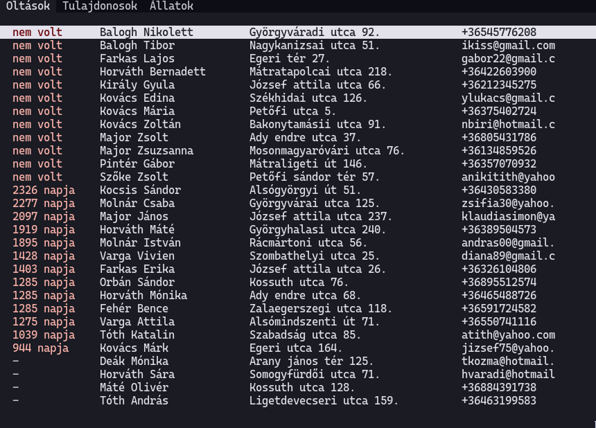
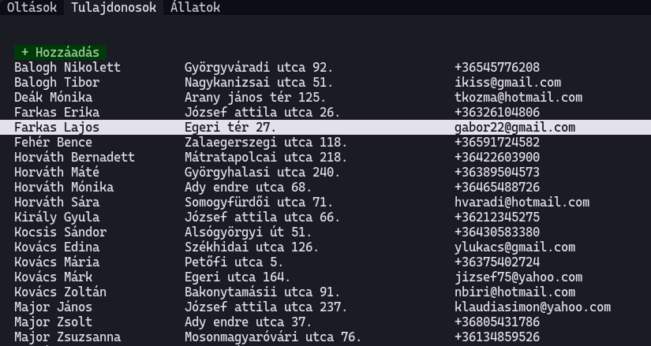
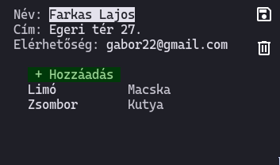
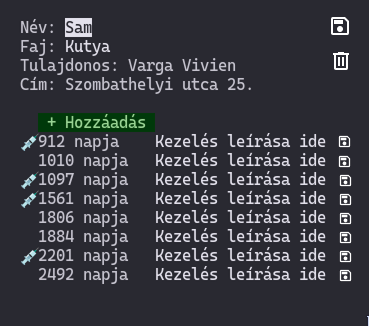
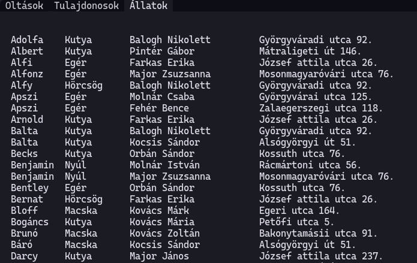

# Spec

Állatorvosi rendelői alkalmazás: tulajdonosok, állatok, kezelések.

## Főoldal: esedékes oltások

A tulajdonosok listája, mellette a legrégebben oltott állat oltásának ideje.

## Tulajdonosok oldal

A Hozzáadás gomb megnyit egy új, üres tulajdonos oldalt.

Tulajdonosra kattintás után megnyílik a tulajdonos oldal.

## Tulajdonos oldal

Egy tulajdonos adatai és állatai.

Név, cím, elérhetőség szerkeszthető, enter vagy a mentés ikon ment.

Törlés ikon törli a tulajdonost, állatait és a kezeléseket, majd átirányít a főolalra.

A Hozzáadás gomb megnyit egy új, üres állat oldalt a megfelelő tulajdonossal beállítva.

## Állat oldal

Állat adatai és kezelései.

Név, faj szerkeszthető, enter vagy mentés ikon ment.

Törlés ikon kitörli az állatot és kezeléseit, és átirányít a gazdájához.

Hozzáadás gomb létrehoz egy új kezelést.

Ugyanezen az oldalon szerkeszthető, hogy volt-e oltva az állat (egy checkboxxal) és a kezelés egyéb leírása. Menteni enterrel vagy a mentés ikonnal lehet.

## Állatok oldal

Állatok listája, kattintásra megnyílik az adott állat oldala.

